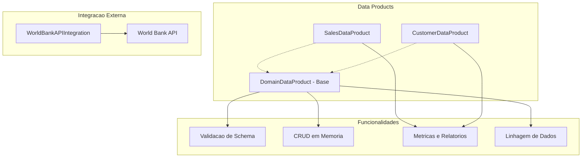
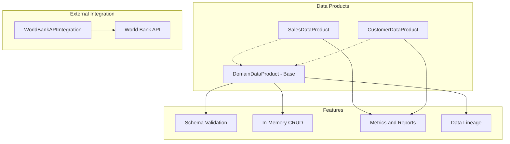

# Data Mesh Implementation Framework

Framework demonstrativo de Data Mesh em Python com Data Products, validacao de schema e integracao com API do World Bank.

[](https://python.org)
[](LICENSE)

[English](#english) | [Portugues](#portugues)

---

## Portugues

### Visao Geral

Implementacao demonstrativa dos conceitos de Data Mesh em Python puro. Fornece classes de Data Products com validacao de schema, operacoes CRUD em memoria, rastreamento de linhagem de dados, e integracao com a API REST do World Bank para dados de indicadores por pais.

Todos os dados sao armazenados em memoria (listas de dicionarios). Nao ha persistencia em banco de dados, orquestracao de pipelines, ou infraestrutura real de Data Mesh.

### Arquitetura



### Funcionalidades

- **Data Products** — classes base e especializadas com validacao de schema
- **CRUD em memoria** — adicionar, atualizar, remover e buscar registros
- **Validacao de schema** — verificacao de tipos (str, int, float, bool, datetime) nos dados de entrada
- **Metricas de vendas** — receita total, por categoria, ticket medio
- **Segmentacao de clientes** — segmentos customizaveis por criterios
- **Qualidade de dados** — relatorio de campos nulos, registros duplicados
- **Linhagem de dados** — rastreamento de dependencias entre Data Products
- **Log de acesso** — historico de operacoes por Data Product
- **Integracao World Bank API** — busca de indicadores economicos por pais

### Como Executar

```bash
# Instalar dependencias
pip install -r requirements.txt

# Executar exemplo basico
python examples/basic_example.py

# Executar testes (49 testes)
pytest -v

# Uso programatico
python -c "
from src.sales_data_product import SalesDataProduct
sp = SalesDataProduct('vendas', {'transaction_id': 'str', 'product': 'str', 'amount': 'float'})
sp.add_data({'transaction_id': 'T001', 'product': 'Widget', 'amount': 29.99})
print(sp.get_sales_metrics())
"
```

### Estrutura do Projeto

```
data-mesh-implementation-framework/
├── data/
│   ├── sample_customers.json
│   └── sample_sales.json
├── diagrams/
│   ├── data_mesh_architecture.mmd
│   └── data_product_interaction.mmd
├── docs/
│   └── data_mesh_principles.md
├── examples/
│   ├── README.md
│   └── basic_example.py
├── src/
│   ├── __init__.py
│   ├── api_integration.py          # World Bank API (~185 linhas)
│   ├── customer_data_product.py    # Segmentacao de clientes (~170 linhas)
│   ├── domain_data_product.py      # Classe base (~345 linhas)
│   └── sales_data_product.py       # Metricas de vendas (~160 linhas)
├── tests/
│   ├── __init__.py
│   ├── test_api_integration.py     # Testes da API
│   ├── test_domain_data_product.py # Testes do Data Product base
│   └── test_integration.py         # Testes de integracao
├── .gitignore
├── LICENSE
├── README.md
├── requirements.txt
└── setup.py
```

### Tecnologias

| Tecnologia | Uso |
|------------|-----|
| Python | Linguagem principal |
| requests | Chamadas HTTP (World Bank API) |
| pytest | Framework de testes |

---

## English

### Overview

Demonstrative implementation of Data Mesh concepts in pure Python. Provides Data Product classes with schema validation, in-memory CRUD operations, data lineage tracking, and World Bank REST API integration for country indicator data.

All data is stored in memory (lists of dicts). There is no database persistence, pipeline orchestration, or real Data Mesh infrastructure.

### Architecture



### Features

- **Data Products** — base and specialized classes with schema validation
- **In-memory CRUD** — add, update, remove, and query records
- **Schema validation** — type checking (str, int, float, bool, datetime) on input data
- **Sales metrics** — total revenue, by category, average ticket
- **Customer segmentation** — customizable segments by criteria
- **Data quality** — null field and duplicate record reports
- **Data lineage** — dependency tracking between Data Products
- **Access logging** — operation history per Data Product
- **World Bank API integration** — country economic indicator fetching

### How to Run

```bash
# Install dependencies
pip install -r requirements.txt

# Run basic example
python examples/basic_example.py

# Run tests (49 tests)
pytest -v

# Programmatic usage
python -c "
from src.sales_data_product import SalesDataProduct
sp = SalesDataProduct('sales', {'transaction_id': 'str', 'product': 'str', 'amount': 'float'})
sp.add_data({'transaction_id': 'T001', 'product': 'Widget', 'amount': 29.99})
print(sp.get_sales_metrics())
"
```

### Project Structure

```
data-mesh-implementation-framework/
├── data/
│   ├── sample_customers.json
│   └── sample_sales.json
├── diagrams/
│   ├── data_mesh_architecture.mmd
│   └── data_product_interaction.mmd
├── docs/
│   └── data_mesh_principles.md
├── examples/
│   ├── README.md
│   └── basic_example.py
├── src/
│   ├── __init__.py
│   ├── api_integration.py          # World Bank API (~185 lines)
│   ├── customer_data_product.py    # Customer segmentation (~170 lines)
│   ├── domain_data_product.py      # Base class (~345 lines)
│   └── sales_data_product.py       # Sales metrics (~160 lines)
├── tests/
│   ├── __init__.py
│   ├── test_api_integration.py     # API tests
│   ├── test_domain_data_product.py # Base Data Product tests
│   └── test_integration.py         # Integration tests
├── .gitignore
├── LICENSE
├── README.md
├── requirements.txt
└── setup.py
```

### Technologies

| Technology | Usage |
|------------|-------|
| Python | Core language |
| requests | HTTP calls (World Bank API) |
| pytest | Testing framework |

---

**Autor / Author:** Gabriel Demetrios Lafis
- GitHub: [@galafis](https://github.com/galafis)
- LinkedIn: [Gabriel Demetrios Lafis](https://linkedin.com/in/gabriel-demetrios-lafis)
