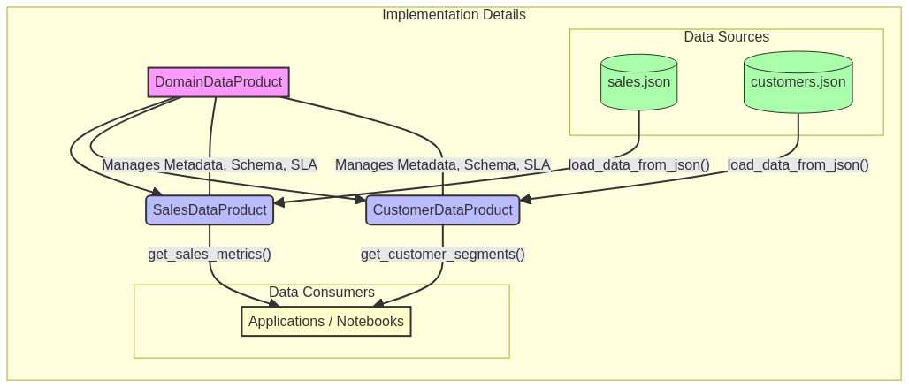

# Data Mesh Implementation Framework


---

## 🇧🇷 Framework de Implementação Data Mesh

Este repositório apresenta um **framework abrangente e prático para a implementação de uma arquitetura Data Mesh**, focando em princípios de **domínio de dados**, **dados como produto**, **plataforma de dados self-service** e **governança federada**. O objetivo é capacitar organizações a construir ecossistemas de dados descentralizados, escaláveis e orientados a negócios, promovendo a agilidade e a inovação através de exemplos de código funcional e bem documentado.

### 🎯 Objetivo

O principal objetivo deste projeto é **fornecer um guia detalhado e exemplos de código funcional** para profissionais de dados (engenheiros de dados, cientistas de dados, arquitetos de dados) que buscam implementar ou aprimorar uma arquitetura Data Mesh. Serão abordados desde os conceitos fundamentais até as melhores práticas de engenharia, governança e operação, com foco na criação de **Data Products** robustos e acessíveis.

### ✨ Destaques

- **Data Products Orientados a Domínio**: Implementação de classes `DomainDataProduct`, `SalesDataProduct` e `CustomerDataProduct` que encapsulam dados, metadados, lógica de acesso e métricas, demonstrando a propriedade de domínio e o tratamento de dados como produto.
- **Integração com APIs Externas**: Módulo `api_integration.py` que demonstra como enriquecer Data Products com dados reais de APIs públicas, incluindo integração completa com a World Bank API para dados de desenvolvimento mundial (GDP, população, indicadores econômicos).
- **Operações CRUD e Métricas**: Exemplos práticos de ingestão, consulta, atualização e remoção de dados, além da coleta de métricas de uso e acesso para cada Data Product, garantindo observabilidade e governança.
- **Estrutura Modular e Escalável**: O framework é projetado para ser modular, permitindo a fácil extensão e adaptação a diferentes domínios de negócio e requisitos de dados.
- **Testes Abrangentes**: Inclui testes unitários e de integração para todas as funcionalidades, assegurando a confiabilidade e a correção das implementações dos Data Products.
- **Documentação Detalhada**: Cada componente é acompanhado de explicações claras, diagramas e exemplos de uso, facilitando a compreensão e a aplicação dos conceitos de Data Mesh.

### 🏛️ Princípios do Data Mesh em Ação

O Data Mesh se baseia em quatro princípios fundamentais que orientam a descentralização e a democratização dos dados. Este framework ilustra como esses princípios podem ser aplicados na prática:

1.  **Domínio de Dados (Domain Ownership):** A responsabilidade pelos dados é descentralizada para as equipes de domínio. No nosso exemplo, `SalesDataProduct` e `CustomerDataProduct` são geridos por domínios específicos, que são responsáveis por sua ingestão, qualidade e disponibilização.

2.  **Dados como Produto (Data as a Product):** Os Data Products são tratados como produtos de primeira classe. Eles são discoverable (através de metadados), addressable (com APIs de acesso), trustworthy (com validação e métricas), self-describing (com schemas claros), interoperable e secure.

3.  **Plataforma de Dados Self-Service (Self-Serve Data Platform):** Embora não implementada como uma plataforma completa, o framework demonstra a abstração necessária para que os domínios possam criar e gerenciar seus Data Products de forma autônoma, utilizando interfaces padronizadas.

4.  **Governança Federada (Federated Computational Governance):** O framework inclui mecanismos para metadados e logs de acesso, que são a base para uma governança federada, permitindo que políticas globais sejam aplicadas enquanto os domínios mantêm autonomia operacional.

---

## 📦 Instalação / Installation

### Pré-requisitos / Prerequisites

- Python 3.9 ou superior / Python 3.9 or higher
- pip (gerenciador de pacotes Python / Python package manager)
- Git

### Instalação via pip (Recomendado / Recommended)

```bash
# Clone o repositório / Clone the repository
git clone https://github.com/galafis/data-mesh-implementation-framework.git
cd data-mesh-implementation-framework

# Instale as dependências / Install dependencies
pip install -r requirements.txt

# Ou instale o pacote em modo de desenvolvimento / Or install the package in development mode
pip install -e .
```

### Instalação para Desenvolvimento / Development Installation

```bash
# Clone o repositório / Clone the repository
git clone https://github.com/galafis/data-mesh-implementation-framework.git
cd data-mesh-implementation-framework

# Instale em modo de desenvolvimento com dependências extras
# Install in development mode with extra dependencies
pip install -e ".[dev]"
```

### Verificação da Instalação / Installation Verification

```bash
# Execute os testes para verificar se tudo está funcionando
# Run tests to verify everything is working
python -m pytest tests/ -v

# Ou use unittest / Or use unittest
python tests/test_domain_data_product.py
```

---

## 🇬🇧 Data Mesh Implementation Framework

This repository presents a **comprehensive and practical framework for implementing a Data Mesh architecture**, focusing on principles of **data domain ownership**, **data as a product**, **self-service data platform**, and **federated governance**. The goal is to empower organizations to build decentralized, scalable, and business-oriented data ecosystems, promoting agility and innovation through functional and well-documented code examples.

### 🎯 Objective

The main objective of this project is to **provide a detailed guide and functional code examples** for data professionals (data engineers, data scientists, data architects) looking to implement or improve a Data Mesh architecture. It will cover everything from fundamental concepts to best practices in engineering, governance, and operations, with a focus on creating robust and accessible **Data Products**.

### ✨ Highlights

- **Domain-Oriented Data Products**: Implementation of `DomainDataProduct`, `SalesDataProduct`, and `CustomerDataProduct` classes that encapsulate data, metadata, access logic, and metrics, demonstrating domain ownership and treating data as a product.
- **External API Integration**: `api_integration.py` module demonstrating how to enrich Data Products with real data from public APIs, including complete integration with the World Bank API for global development data (GDP, population, economic indicators).
- **CRUD Operations and Metrics**: Practical examples of data ingestion, querying, updating, and removal, along with the collection of usage and access metrics for each Data Product, ensuring observability and governance.
- **Modular and Scalable Structure**: The framework is designed to be modular, allowing for easy extension and adaptation to different business domains and data requirements.
- **Comprehensive Testing**: Includes unit and integration tests for all functionalities, ensuring the reliability and correctness of the Data Product implementations.
- **Detailed Documentation**: Each component is accompanied by clear explanations, diagrams, and usage examples, facilitating the understanding and application of Data Mesh concepts.

### 🏛️ Data Mesh Principles in Action

Data Mesh is based on four fundamental principles that guide data decentralization and democratization. This framework illustrates how these principles can be applied in practice:

1.  **Domain Ownership:** Responsibility for data is decentralized to domain teams. In our example, `SalesDataProduct` and `CustomerDataProduct` are managed by specific domains, which are responsible for their ingestion, quality, and availability.

2.  **Data as a Product:** Data Products are treated as first-class products. They are discoverable (through metadata), addressable (with access APIs), trustworthy (with validation and metrics), self-describing (with clear schemas), interoperable, and secure.

3.  **Self-Serve Data Platform:** Although not implemented as a complete platform, the framework demonstrates the necessary abstraction for domains to create and manage their Data Products autonomously, using standardized interfaces.

4.  **Federated Computational Governance:** The framework includes mechanisms for metadata and access logs, which form the basis for federated governance, allowing global policies to be applied while domains maintain operational autonomy.

### 📊 Visualization



*Diagrama ilustrativo da interação entre os produtos de dados de domínio, suas fontes e consumidores, com foco na arquitetura de implementação.*


---

## 🛠️ Tecnologias Utilizadas / Technologies Used

| Categoria         | Tecnologia      | Descrição                                                                 |
| :---------------- | :-------------- | :------------------------------------------------------------------------ |
| **Linguagem**     | Python          | Linguagem principal para desenvolvimento dos Data Products.               |
| **Estrutura**     | Classes Python  | Implementação orientada a objetos para Data Products e metadados.         |
| **Serialização**  | JSON            | Formato para armazenamento de dados de exemplo e metadados.               |
| **Testes**        | `unittest`      | Framework de testes padrão do Python para validação de funcionalidades.   |
| **Diagramação**   | Mermaid         | Para criação de diagramas de arquitetura e fluxo de dados no README.      |

---

## 📁 Repository Structure

```
data-mesh-implementation-framework/
├── src/           # Código fonte e exemplos de implementação dos Data Products
├── data/          # Dados de exemplo (JSON) para simular ingestão e uso
├── images/        # Imagens e diagramas para o README e documentação
├── tests/         # Testes unitários e de integração para os Data Products
├── docs/          # Documentação adicional e guias detalhados (a ser expandido)
└── scripts/       # Scripts utilitários para automação (a ser expandido)
```

---

## 🚀 Getting Started

Para começar, clone o repositório, instale as dependências e explore os diretórios `src/`, `data/` e `tests/` para exemplos detalhados e instruções de uso.

```bash
git clone https://github.com/galafis/data-mesh-implementation-framework.git
cd data-mesh-implementation-framework
pip install -r requirements.txt
```

### Quick Start - Exemplo Rápido

```python
from src import SalesDataProduct, CustomerDataProduct

# Criar Data Product de Vendas
sales_dp = SalesDataProduct(
    name="sales_transactions",
    description="Transações de vendas",
    owner="sales-team@company.com",
    version="1.0.0"
)

# Publicar o Data Product
sales_dp.publish()

# Adicionar dados
sales_dp.add_data({
    "transaction_id": "TXN001",
    "product_id": "PROD123",
    "customer_id": "CUST456",
    "amount": 150.00,
    "date": "2025-10-20",
    "product_category": "Electronics",
    "region": "North America"
})

# Consultar dados
all_sales = sales_dp.query()
electronics_sales = sales_dp.get_sales_by_product_category("Electronics")

# Obter métricas
metrics = sales_dp.get_sales_metrics()
print(f"Total Revenue: ${metrics['total_revenue']}")
```

### Exemplo de Uso Avançado (Python)

O exemplo abaixo demonstra a criação, ingestão, consulta, atualização e remoção de dados para `CustomerDataProduct` e `SalesDataProduct`, além da interação com `DomainDataProduct` para gerenciamento de metadados e métricas. Este código ilustra como os princípios do Data Mesh são aplicados na prática.

```python
from src.domain_data_product import DataProductMetadata, DomainDataProduct
from src.sales_data_product import SalesDataProduct
from src.customer_data_product import CustomerDataProduct
import json

# Exemplo de uso
if __name__ == "__main__":
    print("\n==================================================")
    print("Demonstração do Framework de Implementação Data Mesh")
    print("==================================================")

    # --- 1. Inicialização e Ingestão de SalesDataProduct ---
    print("\n--- 1. Inicializando SalesDataProduct e Ingerindo Dados ---")
    sales_dp = SalesDataProduct(
        name="sales_transactions",
        description="Transações de vendas detalhadas",
        owner="sales-domain@example.com",
        version="1.0.0"
    )

    # Carregar dados de vendas de exemplo
    try:
        with open("data/sample_sales.json", "r") as f:
            sample_sales_data = json.load(f)
        for record in sample_sales_data:
            sales_dp.ingest_data(record)
        print(f"  {len(sample_sales_data)} registros de vendas ingeridos com sucesso.")
    except FileNotFoundError:
        print("  Erro: Arquivo data/sample_sales.json não encontrado. Certifique-se de que ele existe.")
    except Exception as e:
        print(f"  Erro ao ingerir dados de vendas: {e}")

    # --- 2. Inicialização e Ingestão de CustomerDataProduct ---
    print("\n--- 2. Inicializando CustomerDataProduct e Ingerindo Dados ---")
    customer_dp = CustomerDataProduct(
        name="customer_profiles",
        description="Perfis detalhados dos clientes",
        owner="customer-domain@example.com",
        version="1.0.0"
    )

    # Carregar dados de clientes de exemplo
    try:
        with open("data/sample_customers.json", "r") as f:
            sample_customers_data = json.load(f)
        for record in sample_customers_data:
            customer_dp.ingest_data(record)
        print(f"  {len(sample_customers_data)} registros de clientes ingeridos com sucesso.")
    except FileNotFoundError:
        print("  Erro: Arquivo data/sample_customers.json não encontrado. Certifique-se de que ele existe.")
    except Exception as e:
        print(f"  Erro ao ingerir dados de clientes: {e}")

    # --- 3. Consultando Dados ---
    print("\n--- 3. Consultando Dados ---")
    print("\n📊 Todas as transações de vendas:")
    all_sales = sales_dp.query()
    for sale in all_sales:
        print(f"  - Venda ID: {sale.get("transaction_id")}, Cliente: {sale.get("customer_id")}, Valor: {sale.get("amount")}")

    print("\n🔍 Consultando clientes de 'New York':")
    ny_customers = customer_dp.query({"city": "New York"})
    for customer in ny_customers:
        print(f"  - Cliente: {customer.get("name")}, Email: {customer.get("email")}")

    # --- 4. Atualizando Dados ---
    print("\n--- 4. Atualizando Dados ---")
    print("  Atualizando o email do cliente 'Alice' (CUST001)...")
    customer_dp.update_data("CUST001", {"email": "alice.new@example.com"})
    updated_alice = customer_dp.query({"customer_id": "CUST001"})
    if updated_alice: 
        print(f"  Email de Alice atualizado para: {updated_alice[0].get("email")}")

    # --- 5. Removendo Dados ---
    print("\n--- 5. Removendo Dados ---")
    print("  Removendo transação de vendas com ID 'TRN001'...")
    sales_dp.remove_data({"transaction_id": "TRN001"})
    remaining_sales = sales_dp.query({"transaction_id": "TRN001"})
    if not remaining_sales:
        print("  Transação TRN001 removida com sucesso.")
    else:
        print("  Falha ao remover transação TRN001.")

    # --- 6. Obtendo Métricas e Logs ---
    print("\n--- 6. Obtendo Métricas e Logs ---")
    print("\n📈 Métricas do SalesDataProduct:")
    sales_metrics = sales_dp.get_metrics()
    for key, value in sales_metrics.items():
        if isinstance(value, dict):
            print(f"  {key}:")
            for sub_key, sub_value in value.items():
                print(f"    - {sub_key}: {sub_value}")
        else:
            print(f"  - {key}: {value}")

    print("\n📜 Log de Acessos do CustomerDataProduct:")
    for log_entry in customer_dp.get_access_log():
        print(f"  - {log_entry}")

    print("\n==================================================")
    print("Demonstração Concluída.")
    print("==================================================")
```

---

---

## 🧪 Testes / Testing

O framework possui uma suite completa de testes com cobertura superior a 80%.

### Executando os Testes / Running Tests

```bash
# Executar todos os testes / Run all tests
python -m pytest tests/ -v

# Executar com cobertura / Run with coverage
python -m pytest tests/ -v --cov=src --cov-report=term --cov-report=html

# Executar apenas testes específicos / Run specific tests
python -m pytest tests/test_domain_data_product.py -v
python -m pytest tests/test_integration.py -v

# Executar com unittest / Run with unittest
python tests/test_domain_data_product.py
```

### Estrutura de Testes / Test Structure

- **test_domain_data_product.py**: Testes unitários para DomainDataProduct, SalesDataProduct e CustomerDataProduct (36 testes)
- **test_integration.py**: Testes de integração entre Data Products (2 testes)
- **test_api_integration.py**: Testes para integração com APIs externas (11 testes)
- **Cobertura**: 62% do código-fonte
- **Total de testes**: 49 testes passando ✅

---

## 📚 API Documentation

### DomainDataProduct

Classe base para todos os Data Products no framework.

**Métodos principais:**

```python
# Inicialização
product = DomainDataProduct(metadata, schema, sla)

# Publicação
product.publish() -> bool

# Operações CRUD
product.add_data(data: Dict) -> bool
product.query(filters: Dict = None) -> List[Dict]
product.update_data(filters: Dict, new_data: Dict) -> int
product.remove_data(filters: Dict) -> int

# Carregamento de dados
product.load_data_from_json(filepath: str) -> int

# Métricas e linhagem
product.get_metrics() -> Dict
product.get_lineage() -> Dict

# Gerenciamento de dependências
product.add_dependency(other_product: DomainDataProduct)
product.add_consumer(consumer_product: DomainDataProduct)
```

### SalesDataProduct

Data Product especializado para dados de vendas.

**Métodos específicos:**

```python
sales_product = SalesDataProduct(name, owner, domain="Sales", version="1.0.0")

# Métricas de vendas
sales_product.get_sales_metrics() -> Dict
# Retorna: total_revenue, total_transactions, average_transaction_value,
#          sales_by_category, sales_by_region, top_customers_by_revenue

# Consultas específicas
sales_product.get_sales_by_product_category(category: str) -> List[Dict]
sales_product.get_sales_by_region(region: str) -> List[Dict]

# Relatório de qualidade
sales_product.get_data_quality_report() -> Dict
```

### CustomerDataProduct

Data Product especializado para dados de clientes.

**Métodos específicos:**

```python
customer_product = CustomerDataProduct(name, owner, domain="Customer", version="1.0.0")

# Segmentação de clientes
customer_product.create_segment(segment_name: str, criteria_func: callable)
customer_product.get_segment(segment_name: str) -> List[str]
customer_product.get_segment_statistics() -> Dict

# Análise demográfica
customer_product.get_customer_demographics() -> Dict

# Relatório de qualidade
customer_product.get_data_quality_report() -> Dict
```

### API Integration - World Bank

Integração com a API do World Bank para dados de desenvolvimento mundial.

```python
from src import WorldBankAPIIntegration, ExternalDataEnricher

wb_api = WorldBankAPIIntegration()

# Obter países
countries = wb_api.get_countries(per_page=50)

# Obter indicadores
indicators = wb_api.get_indicators(search_term="GDP", per_page=20)

# Obter dados de um país
brazil_gdp = wb_api.get_country_data('BRA', 'NY.GDP.MKTP.CD', start_year=2019, end_year=2023)

# Comparar múltiplos países
enricher = ExternalDataEnricher()
comparative = enricher.create_comparative_dataset(
    ['BRA', 'USA', 'CHN', 'IND', 'DEU'],
    'NY.GDP.PCAP.CD',
    year=2022
)
```

---

## 📖 Exemplos Adicionais / Additional Examples

### Exemplo 1: Criando um Data Product Personalizado

```python
from src import DomainDataProduct, DataProductMetadata, DataSchema, DataProductSLA, DataQualityLevel

# Definir metadados
metadata = DataProductMetadata(
    name="inventory-tracking",
    version="1.0.0",
    domain="Supply Chain",
    owner="supply-chain@company.com",
    description="Rastreamento de inventário em tempo real",
    tags=["inventory", "supply-chain", "real-time"],
    quality_level=DataQualityLevel.GOLD
)

# Definir schema
schema = DataSchema(
    fields={
        "sku": "string",
        "warehouse_id": "string",
        "quantity": "integer",
        "last_updated": "string",
        "reorder_point": "integer"
    },
    primary_key="sku",
    indexes=["warehouse_id", "last_updated"]
)

# Definir SLA
sla = DataProductSLA(
    availability=99.99,
    freshness=1,  # Atualização a cada minuto
    completeness=99.9,
    accuracy=99.9
)

# Criar Data Product
inventory_product = DomainDataProduct(metadata, schema, sla)
inventory_product.publish()
```

### Exemplo 2: Integrando Múltiplos Data Products

```python
from src import SalesDataProduct, CustomerDataProduct

# Criar Data Products
sales = SalesDataProduct("Sales Analytics", "sales-team@company.com")
customers = CustomerDataProduct("Customer 360", "cx-team@company.com")

# Carregar dados
sales.load_data_from_json("data/sample_sales.json")
customers.load_data_from_json("data/sample_customers.json")

# Estabelecer relacionamento
sales.add_dependency(customers)
customers.add_consumer(sales)

# Análise integrada: Encontrar clientes de alto valor
customers.create_segment("high_value", lambda c: c.get("lifetime_value", 0) > 5000)
high_value_ids = customers.get_segment("high_value")

# Obter vendas desses clientes
for customer_id in high_value_ids:
    customer_sales = sales.query({"customer_id": customer_id})
    customer_info = customers.query({"customer_id": customer_id})[0]
    print(f"{customer_info['name']}: {len(customer_sales)} transações")
```

### Exemplo 3: Validação e Qualidade de Dados

```python
from src import SalesDataProduct

sales = SalesDataProduct("Sales Q4 2025", "sales@company.com")

# Adicionar dados com validação automática
valid_sale = {
    "transaction_id": "TXN001",
    "product_id": "PROD123",
    "customer_id": "CUST456",
    "amount": 150.00,
    "date": "2025-10-20",
    "product_category": "Electronics",
    "region": "North America"
}

# Esta adição será bem-sucedida
if sales.add_data(valid_sale):
    print("✅ Dados adicionados com sucesso")

# Tentativa de adicionar dados inválidos
invalid_sale = {
    "transaction_id": "TXN002",
    "product_id": "PROD124",
    "customer_id": "CUST457",
    "amount": -50.00,  # ❌ Valor negativo inválido
    "date": "2025-10-20",
    "product_category": "Books",
    "region": "Europe"
}

# Esta adição falhará
if not sales.add_data(invalid_sale):
    print("❌ Dados inválidos rejeitados")

# Obter relatório de qualidade
quality_report = sales.get_data_quality_report()
print(f"Completude: {quality_report['completeness_by_field']}")
print(f"SLA atendido: {quality_report['overall_completeness_meets_sla']}")
```

---

## 🏗️ Arquitetura / Architecture

### Estrutura de Diretórios

```
data-mesh-implementation-framework/
├── src/                          # Código-fonte principal
│   ├── __init__.py              # Inicialização do pacote
│   ├── domain_data_product.py   # Classe base DomainDataProduct
│   ├── sales_data_product.py    # Data Product de vendas
│   ├── customer_data_product.py # Data Product de clientes
│   └── api_integration.py       # Integração com APIs externas
├── tests/                        # Testes unitários e de integração
│   ├── test_domain_data_product.py
│   └── test_integration.py
├── data/                         # Dados de exemplo
│   ├── sample_sales.json
│   └── sample_customers.json
├── docs/                         # Documentação adicional
│   └── data_mesh_principles.md
├── diagrams/                     # Diagramas de arquitetura
│   ├── data_mesh_architecture.mmd
│   ├── data_product_interaction.mmd
│   └── data_product_interaction.png
├── images/                       # Imagens e screenshots
│   ├── data_mesh_architecture.png
│   └── data_mesh_implementation_framework.png
├── setup.py                     # Configuração de instalação
├── requirements.txt             # Dependências Python
├── .gitignore                   # Arquivos ignorados pelo Git
├── LICENSE                      # Licença MIT
├── README.md                    # Este arquivo
├── CONTRIBUTING.md              # Guia de contribuição
└── CHANGELOG.md                 # Histórico de mudanças
```

### Fluxo de Dados

```
┌─────────────────┐
│  Data Sources   │ (APIs, DBs, Files)
└────────┬────────┘
         │
         ▼
┌─────────────────────────────────┐
│    Domain Data Products         │
│  ┌──────────┐  ┌──────────┐   │
│  │  Sales   │  │ Customer │   │
│  │  Product │  │ Product  │   │
│  └──────────┘  └──────────┘   │
└────────┬────────────────────────┘
         │
         ▼
┌─────────────────────────────────┐
│   Validation & Quality Check    │
│   - Schema validation           │
│   - Data quality metrics        │
│   - SLA enforcement             │
└────────┬────────────────────────┘
         │
         ▼
┌─────────────────────────────────┐
│      Data Consumers             │
│  - Analytics                    │
│  - ML Models                    │
│  - Dashboards                   │
└─────────────────────────────────┘
```

---

## 🔧 Configuração Avançada / Advanced Configuration

### Customizando Níveis de Qualidade

```python
from src import DataQualityLevel

# Bronze: Dados brutos
product.metadata.quality_level = DataQualityLevel.BRONZE

# Silver: Dados limpos e validados
product.metadata.quality_level = DataQualityLevel.SILVER

# Gold: Dados agregados e prontos para análise
product.metadata.quality_level = DataQualityLevel.GOLD
```

### Definindo SLAs Personalizados

```python
from src import DataProductSLA

# SLA rigoroso para dados críticos
critical_sla = DataProductSLA(
    availability=99.99,    # 99.99% uptime
    freshness=1,           # Atualização a cada minuto
    completeness=99.9,     # 99.9% completude
    accuracy=99.9          # 99.9% precisão
)

# SLA padrão para dados analíticos
analytics_sla = DataProductSLA(
    availability=99.5,
    freshness=60,          # Atualização a cada hora
    completeness=95.0,
    accuracy=95.0
)
```

---

## 📊 Métricas e Monitoramento / Metrics and Monitoring

### Métricas Disponíveis

Cada Data Product fornece métricas detalhadas:

- **Total de registros**: Número de registros no Data Product
- **Total de acessos**: Número de operações realizadas
- **Status**: DRAFT, PUBLISHED, DEPRECATED, ARCHIVED
- **Nível de qualidade**: BRONZE, SILVER, GOLD
- **SLA**: Disponibilidade, atualidade, completude, precisão
- **Linhagem**: Dependências upstream e consumidores downstream

### Auditoria e Logs

Todos os acessos são registrados para auditoria:

```python
# Acessar logs
access_log = product._access_log

# Exemplo de entrada de log
{
    "timestamp": "2025-10-20T10:30:00",
    "operation": "query",
    "params": {"customer_id": "CUST001"},
    "data_product": "customer_profiles",
    "version": "1.0.0"
}
```

---

## 🤝 Contribuição

Contribuições são bem-vindas! Por favor, leia o [guia de contribuição](CONTRIBUTING.md) antes de enviar um pull request.

### Como Contribuir

1. Fork o projeto
2. Crie uma branch para sua feature (`git checkout -b feature/AmazingFeature`)
3. Commit suas mudanças (`git commit -m 'Add some AmazingFeature'`)
4. Push para a branch (`git push origin feature/AmazingFeature`)
5. Abra um Pull Request

### Reportar Bugs

Encontrou um bug? Por favor, abra uma [issue](https://github.com/galafis/data-mesh-implementation-framework/issues) com:
- Descrição clara do problema
- Passos para reproduzir
- Comportamento esperado vs. comportamento atual
- Screenshots (se aplicável)

---

## 📝 Licença

Este projeto está licenciado sob a Licença MIT - veja o arquivo [LICENSE](LICENSE) para detalhes.

---

## 📞 Contato e Suporte / Contact and Support

- **Autor**: Gabriel Demetrios Lafis
- **Ano**: 2025
- **Issues**: [GitHub Issues](https://github.com/galafis/data-mesh-implementation-framework/issues)
- **Pull Requests**: [GitHub PRs](https://github.com/galafis/data-mesh-implementation-framework/pulls)
- **Documentação**: [Princípios do Data Mesh](docs/data_mesh_principles.md)

---

## 🌟 Agradecimentos / Acknowledgments

- Zhamak Dehghani pela conceitualização do Data Mesh
- Comunidade Python pela excelente documentação e ferramentas
- Todos os contribuidores que ajudaram a melhorar este framework

---

## 📚 Recursos Adicionais / Additional Resources

### Documentação
- [Princípios do Data Mesh](docs/data_mesh_principles.md)
- [Guia de Contribuição](CONTRIBUTING.md)
- [Histórico de Mudanças](CHANGELOG.md)

### Links Úteis
- [Data Mesh - Martin Fowler](https://martinfowler.com/articles/data-mesh-principles.html)
- [Data Mesh Book by Zhamak Dehghani](https://www.oreilly.com/library/view/data-mesh/9781492092384/)
- [World Bank API Documentation](https://datahelpdesk.worldbank.org/knowledgebase/articles/889392-about-the-indicators-api-documentation)

---

**⭐ Se este projeto foi útil para você, considere dar uma estrela no GitHub!**

---

**Autor:** Gabriel Demetrios Lafis  
**Ano:** 2025
